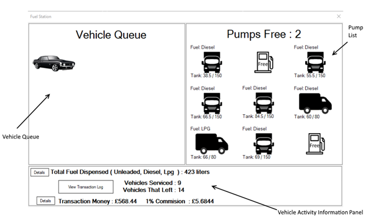

The application’s purpose is to simulate a fuelling station. The fuelling station being simulated has three types of fuel (Unleaded, Diesel and LPG). Random Vehicles appear and queue for fuel. The vehicles being created randomly by the program are either Cars, Vans or HGVs.

Cars can use any of the three types of fuel. Vans can only use Diesel and LPG while HGVs can only use Diesel. The vehicles are to appear and use any fuel type they can randomly.

The application takes count of the vehicles serviced and the vehicles that left before they could get serviced. The application also takes a log of each transaction being made by the vehicles and gives 1% of the total money as commission to the fuel attendant. It takes count of the litters dispensed by each type of fuel and the money it equates to using the rate below:

 - Diesel Fuel (Per litre): £1.35
 - Unleaded Fuel (Per litre): £1.31    
 - LPG Fuel (Per litre): £1.33

